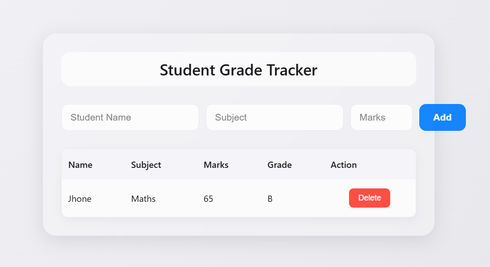

#  Student Grade Tracker

A web application for tracking student grades with automatic grade calculation. Built with HTML, CSS, JavaScript, PHP, and MySQL.

## Features

- ✅ Add student records with name, subject, and marks
- ✅ Automatic grade calculation (A/B/C/D/F based on marks)
- ✅ Delete student records
- ✅ Real-time database updates
- ✅ Beautiful glassmorphism UI with Apple-inspired design
- ✅ Responsive design for mobile and desktop
- ✅ Smooth animations and hover effects

## Grade System

- **A Grade**: 75-100 marks
- **B Grade**: 65-74 marks
- **C Grade**: 50-64 marks
- **D Grade**: 35-49 marks
- **F Grade**: 0-34 marks

## Technologies Used

- **Frontend**: HTML5, CSS3 , JavaScript (ES6+)
- **Backend**: PHP 8.0+
- **Database**: MySQL (via XAMPP)

## FYI

Before you begin, ensure you have the following installed:

- [XAMPP](https://www.apachefriends.org/download.html) (includes Apache, PHP, and MySQL)
- A modern web browser (Chrome, Firefox, Edge, Safari)
- [Git](https://git-scm.com/downloads) (for cloning the repository)

## Installation & Setup

### Step 1: Clone the Repository

git clone https://github.com/binath4/grade-tracker.git

Or download the ZIP file and extract it.

### Step 2: Move Files to XAMPP

Copy the `grade-tracker` folder to your XAMPP `htdocs` directory:

C:\xampp\htdocs\grade-tracker

### Step 3: Start XAMPP

1. Open **XAMPP Control Panel**
2. Click **Start** next to **Apache**
3. Click **Start** next to **MySQL**
4. Both should show green "Running" status

### Step 4: Create the Database

1. Open your browser and go to: `http://localhost/phpmyadmin`
2. Click **SQL** tab at the top
3. Copy the entire content from `database.sql` file
4. Paste it into the SQL window
5. Click **Go**
6. You should see a success message

**Alternative:** Import the SQL file directly:
- Click **Import** tab
- Click **Choose File** and select `database.sql`
- Click **Go**

### Step 5: Run the Application

Open your browser and navigate to:

http://localhost/grade-tracker/index.html

## Usage
1. **Add a Student**:
   - Enter student name in the "Student Name" field
   - Enter subject in the "Subject" field
   - Enter marks (0-100) in the "Marks" field
   - Click **Add** button
   - The student will appear in the table with auto-calculated grade
2. **Delete a Student**:
   - Click the **Delete** button next to any student record
   - Confirm the deletion
   - The record will be removed from both the UI and database
3. **View Grades**:
   - All students are displayed in a table with their grades automatically calculated
   - Hover over rows for smooth visual feedback

##  Configuration
If you need to change database credentials, edit the connection details in `grades.php`:
